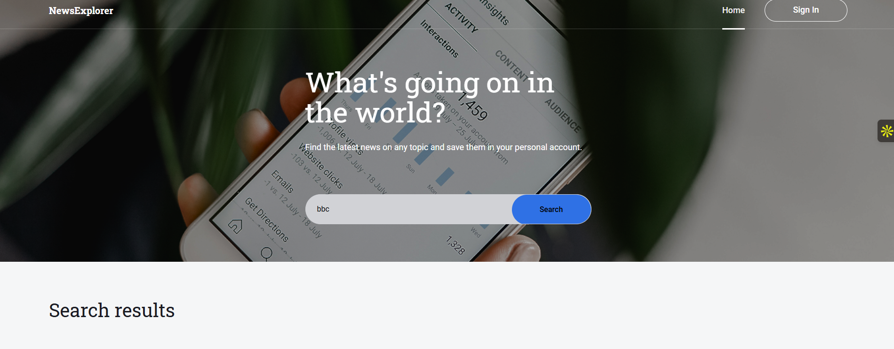
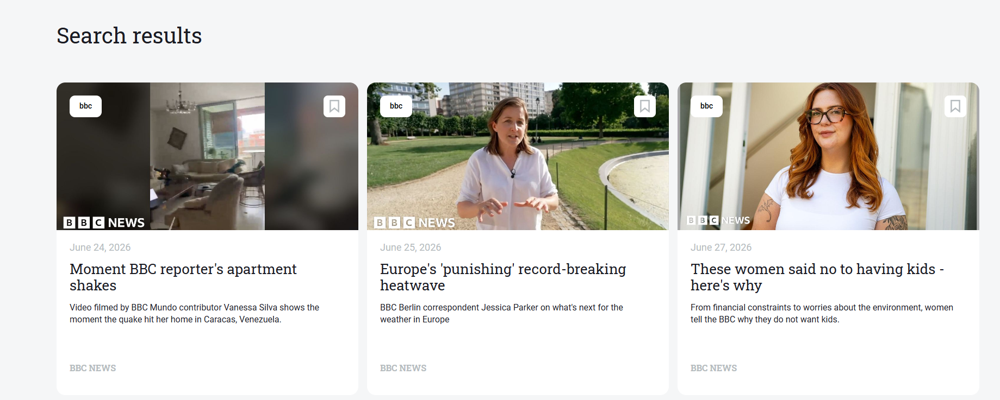
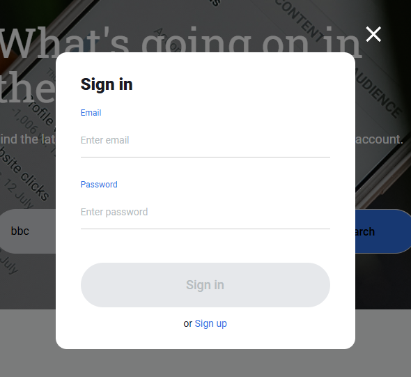
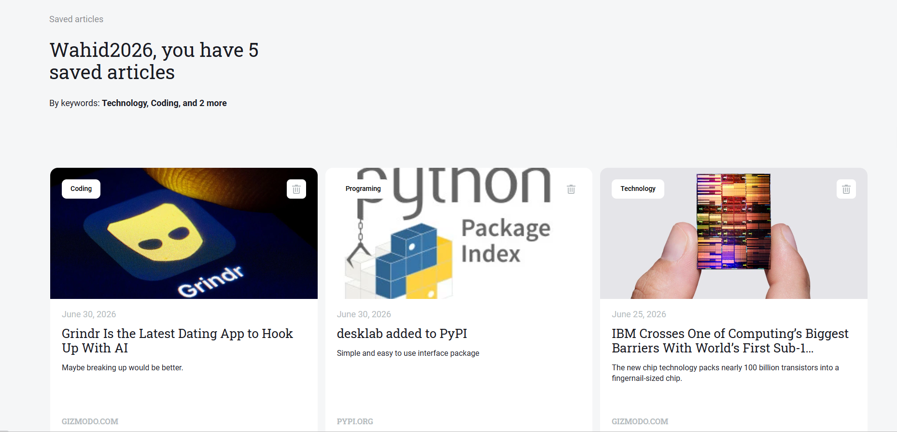

# News Explorer

## Live Demo

Frontend: https://newsexplorer.xyz  
Backend API: https://api.newsexplorer.xyz

## Repository

Frontend Repository: https://github.com/Wahid2025-Fayeq/news-explorer-frontend

Backend Repository: https://github.com/Wahid2025-Fayeq/news-explorer-backend

## Overview

News Explorer is a full-stack web application that allows users to search for the latest news, create an account, sign in securely, and save favorite articles for future reading. The frontend is built with React and Vite, while the backend uses Express, MongoDB, and JWT authentication. Both applications are deployed on Google Cloud with Nginx and HTTPS.

---

### Homepage



### Search Results



### Sign In



### Saved Articles



## Features

- Search for news articles using a live News API
- Responsive design for desktop, tablet, and mobile devices
- Dynamic article rendering
- Loading state with preloader
- Error handling for failed API requests
- "Nothing Found" state when no articles match a search
- "Show More" functionality for displaying additional results
- Mobile navigation menu with responsive behavior
- Login modal interface
- React Router navigation
- Clean and reusable component architecture
- User registration
- Secure user authentication (JWT)
- Protected routes
- Save favorite articles
- Delete saved articles
- Persistent storage with MongoDB

---

## Technologies Used

### Frontend

- React
- Vite
- JavaScript (ES6+)
- React Router
- HTML5
- CSS3
- Responsive Web Design
- BEM Methodology

### Backend

- Node.js
- Express.js
- MongoDB
- Mongoose
- JWT Authentication
- bcryptjs
- Celebrate/Joi Validation
- PM2
- Nginx
- Google Cloud VM
- Let's Encrypt SSL

### API Integration

- News API
- Fetch API
- Environment Variables (.env)

### Development Tools

- Git
- GitHub
- Visual Studio Code
- Figma

---

## Concepts Practiced

This project demonstrates:

- Component-based development
- State management with React Hooks
- Conditional rendering
- API requests and asynchronous JavaScript
- Error handling
- Responsive layouts
- Mobile-first design principles
- Form validation
- Routing with React Router
- Reusable UI components
- Clean project structure

---

## Project Structure

```text
src/
├── assets/
├── components/
│   ├── Header/
│   ├── Navigation/
│   ├── SearchForm/
│   ├── NewsCard/
│   ├── NewsCardList/
│   ├── LoginModal/
│   ├── Preloader/
│   ├── NothingFound/
│   ├── Footer/
│   ├── About/
│   └── SavedNews/
├── utils/
│   ├── newsApi.js
│   └── constants.js
├── vendor/
└── App.jsx
```

---

## Installation

Clone the repository:

```bash
git clone https://github.com/Wahid2025-Fayeq/news-explorer-frontend.git
```

Install dependencies:

```bash
npm install
```

Create a `.env` file:

```env
VITE_NEWS_API_KEY=your_api_key
```

> Note: This repository contains the frontend application. To use authentication and saved articles, the News Explorer backend must also be running and accessible.

Start the development server:

```bash
npm run dev
```

Build for production:

```bash
npm run build
```

---

## About the Author


Wahid Fayeq is a Software Engineering student at TripleTen with a background in technical support, networking, and software development. He is passionate about building responsive web applications, solving technical challenges, and expanding his expertise in full-stack development, cloud technologies, and networking.

### Connect with Me

- GitHub: https://github.com/Wahid2025-Fayeq
- LinkedIn: https://www.linkedin.com/in/wahid-fayeq-se/

This project was developed as part of the TripleTen Software Engineering Program.

## Project Pitch Video

Check out [this video](https://www.loom.com/share/c343a584aa5a427a9c3c5f93b9a0cbef), where I describe my project and some of the challenges I faced while building it.
